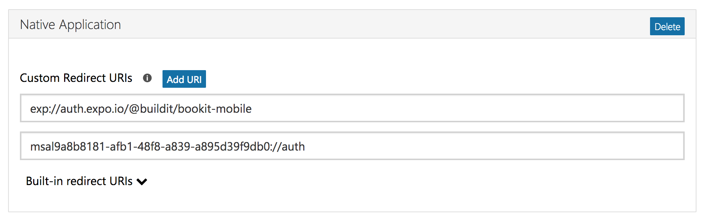

# Bookit Mobile


[](http://bookit-mobile-artifacts.s3-website-us-east-1.amazonaws.com/reports/)


A booking app written in React Native.

## Getting started

Create a file called `config.json` in the project root. It should take the form of `config-sample.json`.

```bash
yarn  # Install dependencies
```

Run validations:

```bash
yarn test  # Lint the Javascript and run unit tests
yarn lint  # Run the linter alone
yarn test:unit  # Run the unit tests alone
yarn test:unit-watch  # Run the unit tests, and rerun on changes
yarn e2e  # Run end-to-end tests. See below for setup instructions.
```

## E2E Testing

End-to-end testing is a bit more complicated than the other validations. Our end-to-end tests run against an iPhone simulator and an Android emulator.

The tests are defined in the `e2e` folder.

### Prerequisites to running end-to-end tests locally
You need a few prerequisites to run end-to-end tests locally. (This is Mac-specific!)

Install the following programs:

`appium` -- Install with `npm -g install appium`

`virtualenv` -- Install with `pip install virtualenv`

`jq` -- Install with `brew install jq`

`carthage` -- Install with `brew install carthage`

Android Studio -- Download available [here](https://developer.android.com/studio/index.html) and configure Android Emulator

### Run end-to-end tests
`/Users/<you>/Library/Android/sdk/tools/emulator @Pixel_API_27`  # Run Android Emulator

`export ANDROID_HOME=/Users/<you>/Library/Android/sdk`  # Make your Android Sdk available to Appium

`appium`  # Run Appium server

`yarn e2e`  # Run the tests!

### Notes on end-to-end tests
- You don't have to start iPhone simulator. Appium does this for you.
- End-to-end tests are written in Python so they are compatible with Amazon's device farm.
- The script that detects if Appium is running is known to be a bit flaky. You can use `yarn e2e -a` to override the check and run the tests anyway.
- The tests will create a `workspace` directory that is gitignored. You are welcome to delete this between tests but it stores all of the python dependencies so deleting it will make the tests take longer to run. You can safely ignore this folder.
- Expo handles new code differently on different platforms.
  - On iOS it downloads updates before starting the app so new code is there immediately.
  - Android downloads the code in the background so the app has to be restarted in order to see new code.
- If you have the processors/cores, this will attempt to run both Android and iOS tests simultaneously. Android tests will probably take a bit longer because we have to download the new code and restart the app.


## Expo

Build configuration is delegated to [Expo](https://expo.io/). Check their docs for complete info, but to get going, you can open the project in Expo's developer environment. This allows you to run the app on simulated devices (iOS and Android). You can also run the app in dev mode on your actual device, which gives you live reload, debugging, and other niceties.

## DB management scripts

Scripts to make development a little easier.

Delete all bookings. (Check the script and make sure you're pointing to the right server instance!)

```bash
node scripts/delete-all-bookings.js
```

## Microsoft auth

The app uses Microsoft for authentication.



To configure Bookit Mobile to work with your MS App:

1) Go to the configuration page for your MS app: https://apps.dev.microsoft.com/#/application/[your-app-id]

1) Add a "Native Application".

1) Add Bookit's OAuth redirect URI to the "Custom Redirect URIs" section.

1) Put the relevant MS app details in `config.json`. See `config-sample.json` for a guide on creating a valid `config.json`. (Or ask a friend!)
