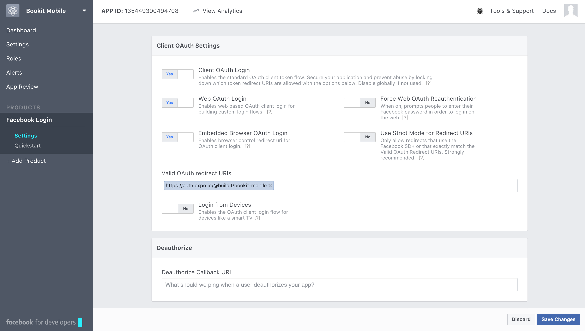

# Bookit Mobile


A booking app written in React Native.

## Getting started
Create a file called `config.js` in the project root. It should take the form of `config-sample.js`.

```
yarn  # Install dependencies
```

Run validations:
```
yarn test  # Lint the Javascript and run unit tests
yarn lint  # Run the linter alone
yarn test:unit  # Run the unit tests alone
yarn test:unit-watch  # Run the unit tests, and rerun on changes
```

## Expo
Build configuration is delegated to [Expo](https://expo.io/). Check their docs for complete info, but to get going, you can open the project in Expo's developer environment. This allows you to run the app on simulated devices (iOS and Android). You can also run the app in dev mode on your actual device, which gives you live reload, debugging, and other niceties.


## DB management scripts
Scripts to make development a little easier.

Delete all bookings. (Check the script and make sure you're pointing to the right server instance!)
```
node scripts/delete-all-bookings.js  
```

## Facebook auth
The app uses Facebook for authentication.
1) Create an "App" at https://developers.facebook.com
2) Add the "Facebook Login" product
3) Put Bookit's OAuth redirect URI in the Client OAuth Settings. 
4) Put the Facebook app id in `config.js` under the property name 'facebookAppId'.
